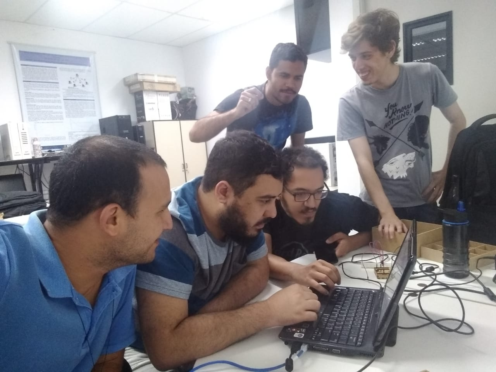
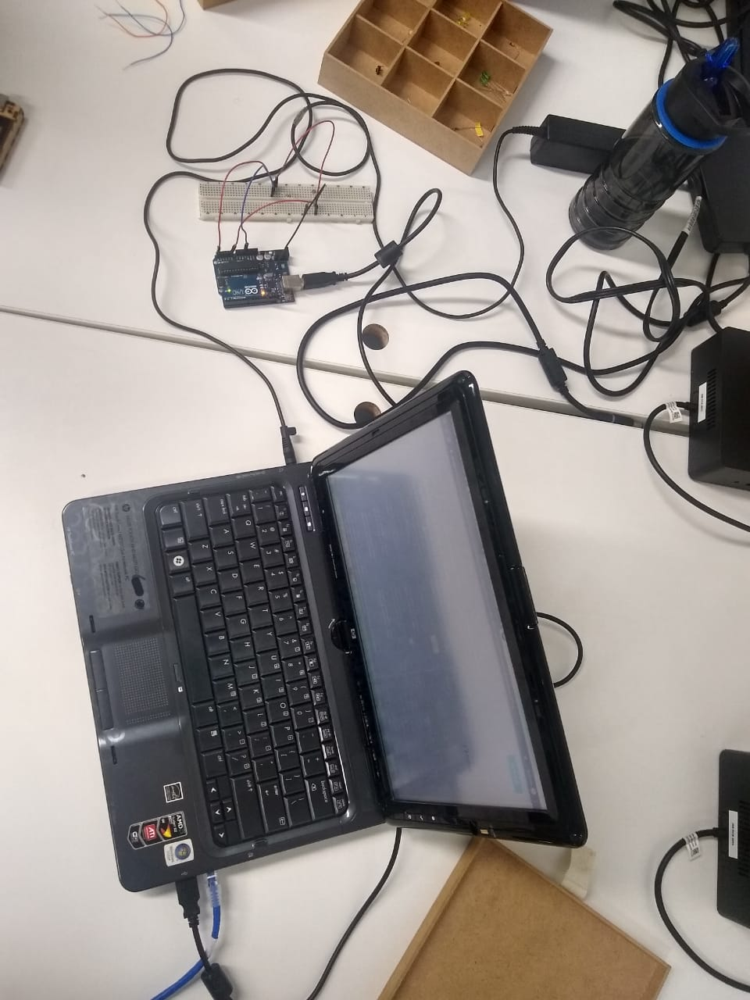
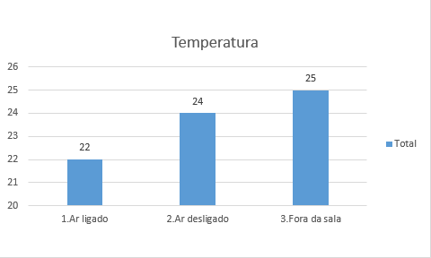
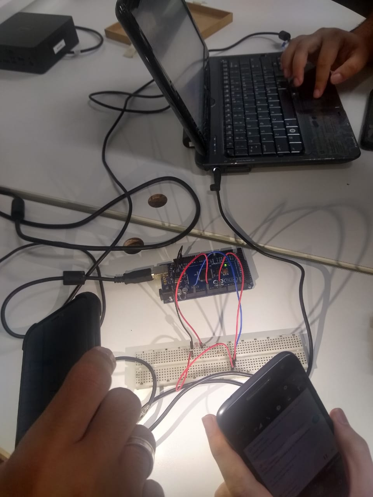
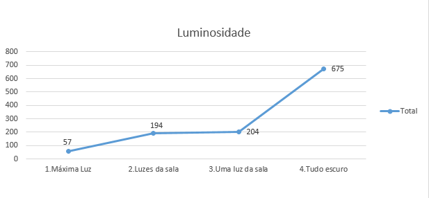

# Cidade Maravilhosa

Este relatório é referente ao experimento com Arduino da disciplina de Computação Ubíqua - UFF 2019.2.

Professor: José Viterbo Filho

Alunos: Carlos Alberto Teixeira Damas, Felipe José Perpétuo Assad, Hugo Caetano Borges Carneiro, Rafael de Araujo Skinner e Yan Provenzano.

Data: 12/11/2019

## Descrição da Atividade

Desenvolver um projeto com Arduino, medir temperatura e luminosidade. Coletar através da interface serial (usando o Javino) os valores e plotar um gráfico dos dados.

## Motivação

O verão está se aproximando e junto com ele os desafios para viver na Cidade Maravilhosa com temperaturas tão elevadas. Deixar o ar condicionado ligado o dia inteiro é o desejo de qualquer carioca, mas nem todos têm condições de arcar tal despesa. Diante dessa situação, torna-se útil o desenvolvimento de uma apliacação para resolver o desafio de equilibrar o bem estar com as despesas do consumidor. O conceito inova a otimização da gestão de consumo eficiente de modo a avisar ao usuário o momento ideal para realizar alguma alteração na temperatura do ar, tendo sido esses padrões configurados previamente.

São duas as possibilidades para notificar o usuário: por temperatura ou por luminosidade. 

### Temperatura

À medida que a temperatura aumenta, diminui-se a temperatura do ar condicionado de maneira a otimizar os gastos energéticos. Ou seja, Se 22° é suficiente para amenizar o calor do ambiente, não há então necessidade do usuário diminuir a temperatura para 16° e com isso gastar muito mais energia.

### Luminosidade

Tendo em vista que luz é fonte de calor, a aplicação compreende que quanto maior a luminosidade maior a necessidade de diminuir a temperatura do ar condicionado.

## Materiais

Para desenvolver esta aplicação foram utilizados os seguintes hardwares: Arduino UNO, protoboard, sensor de lumninosidade, sensor de temperatura, resistores. Foram também utilizados os seguintes softwares: Arduino, Netbeans, Javino, Python 2.7, PySerial.

## Experimento 

O experimento foi realizado no dia 12 de novembro de 2019 no Laboratório de Pesquisa (sala 403) com a presença de todos os alunos, a máquina disponibilizada pela aluna de doutorado Mônica e o kit do arduino disponibilizado peloprofessor Pantoja.

O primeiro passo do experimento foi a instaladção dos softwares Netbeans, Arduino, Python 2.7 e PySerial. Em seguida foi criado um projeto no Netbeans e adicionada a biblioteca Javino nele. Por fim, foi também adicionada a biblioteca Javino no Arduino.

Após a instalação, foi montado o circuito com o arduino e a protoboard. Uma das configurações do circuito montado está mostrado na foto abaixo.

## Gráficos

### Temperatura

Para o experimento da temperatura, foi utilizado o ar condicionado da sala 403. Inicialmente ligado há mais de uma hora, o valor obtido foi 22 graus. Num segundo momento, após desligar o ar e esperar bons minutos, o valor obtido foi 24 graus. Por fim, colocando o hardware para fora da sala para medir a temperatura do corredor, o valor obtido foi 25 graus.

### Luminosidade

Para o experimento de luminosidade, inicialmente foi utilizado o máximo de luminosidade sobre o sensor, isto é, todas as luzes da sala acesas e duas lanternas de celular acesas também exatamente acima do sensor. Nessa condição, foram obtidos valores em torno de 57 u.l.. 

Em seguida, foram retiradas as luzes das lanternas apenas e os valores obtidos foramepor volta de 194 u.l.. Em um terceiro experimento, foi desligada uma única luz da sala e assim foram obtidos valores flutuando em 204 u.l.. Por fim, foi retirada qualquer luminosidade da sala e o sensor de luminosidade obteve valores em média de 675 u.l.

OBS: Os valores obtidos no experimento foram obtidos no dia do experimento e anotado para serem plotados em um gráfico pelo excel.

## Conclusão
